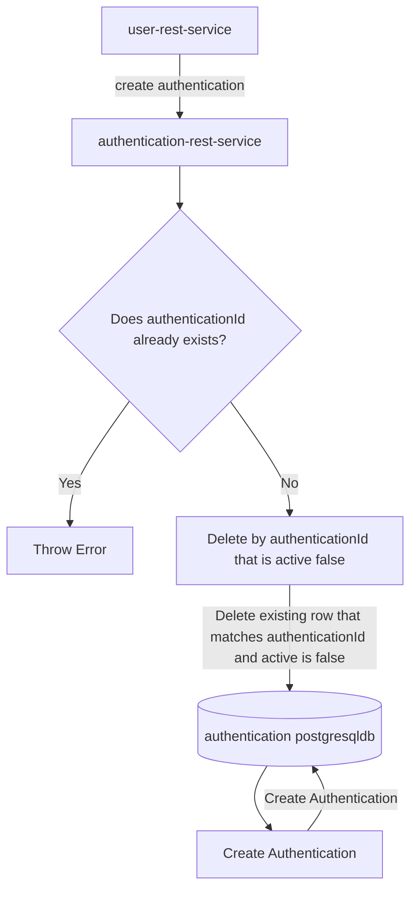
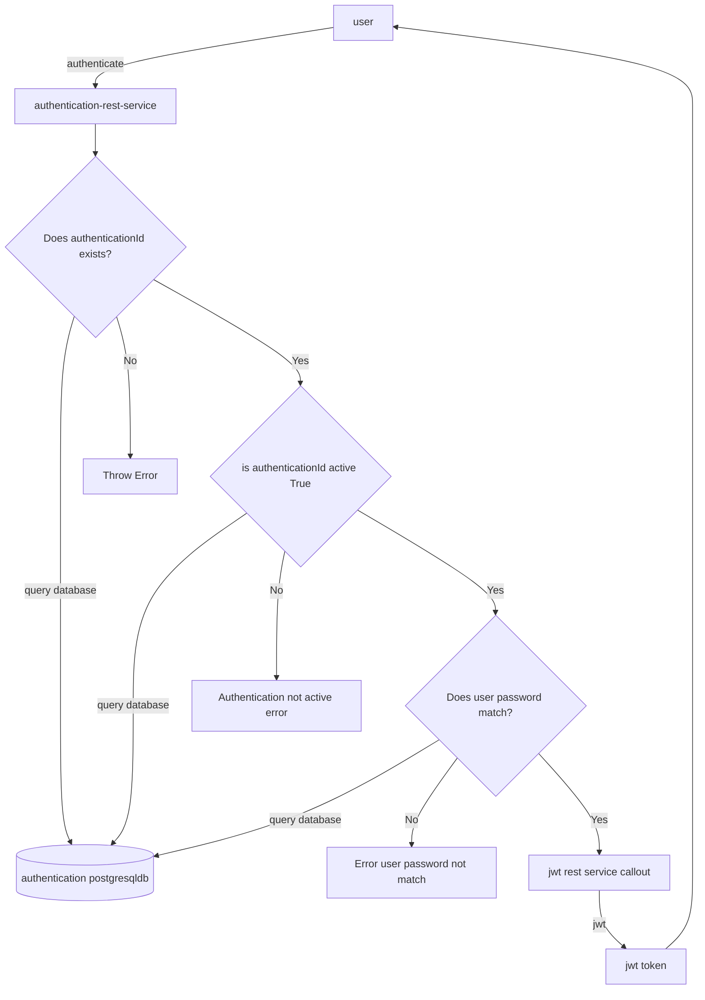

# authentication-rest-service

This is the Authentication rest service.  It is used internally by the 
user-rest-service during user signup and also used for authentication
using username/password and api-key to generate a JWT.

## Run locally using profile
Use the following to run local profile which will pick up properties defined in the `application-local.yml` :


```
mvn spring-boot:run -Dspring-boot.run.arguments="--spring.profiles.active=local"
```

Or you can do something like following too to specify the db server properties:

```
mvn spring-boot:run -Dspring-boot.run.arguments="--server.port=8083 --jwt.issuer=sonam.us \
    --POSTGRES_USERNAME=test \
    --POSTGRES_PASSWORD=test \
    --POSTGRES_DBNAME=authentication \
    --POSTGRES_SERVICE=localhost:5432
    --DB_SSLMODE=disable
    --eureka.client.enabled=false"                      
```
 
 
## Build Docker image

Build docker image using included Dockerfile.


`docker build -t imageregistry/project-rest-service:1.0 .` 

## Push Docker image to repository

`docker push imageregistry/project-rest-service:1.0`

## Deploy Docker image locally

```
docker run -e POSTGRES_USERNAME=test \
  -e POSTGRES_PASSWORD=test -e POSTGRES_DBNAME=authentication \
  -e POSTGRES_SERVICE=localhost:5432 \
 --publish 8082:8080 imageregistry/authentication-rest-service:1.0
```


## Installation on Kubernetes
Use my Helm chart here @ [sonam-helm-chart](https://github.com/sonamsamdupkhangsar/sonam-helm-chart):

```
helm install project-api sonam/mychart -f values.yaml --version 0.1.12 --namespace=yournamespace
```

##Instruction for port-forwarding database pod
```
export project=<PROJECTNAME>
export yournamespace=<NAMESPACE>
export PGMASTER=$(kubectl get pods -o jsonpath={.items..metadata.name} -l application=spilo,cluster-name=$project-minimal-cluster,spilo-role=master -n $yournamespace) 
echo $PGMASTER
kubectl port-forward $PGMASTER 6432:5432 -n backend
```

###Login to database instruction
```
export secretName=<USER>.<PROJECT>-minimal-cluster.credentials.postgresql.acid.zalan.do
export PGPASSWORD=$(kubectl get secret $secretName -o 'jsonpath={.data.password}' -n backend | base64 -d)
echo $PGPASSWORD
export PGSSLMODE=require
psql -U <USER> -d projectdb -h localhost -p 6432

```

port forward authentication service:

`kubectl port-forward authentication-rest-service-mychart-1238293  8001:8080
`


## Create Authentication workflow


## Authentication workflow
The following is the workflow for authentication which will return a JWT token:

